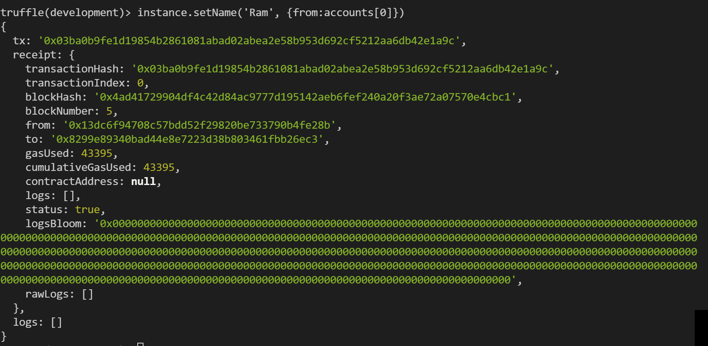

# solana-demo
----
[](https://github.com/ellerbrock/open-source-badges/)
[](https://opensource.org/licenses/MIT)
<!--  -->
<h2 align="center">this app is to test out the solana blockchain</h2>

<!-- <h4 align="center">________________________</h4> -->


# Quick start
### __________________
<!-- 
##### __________________________
```bash
``` 
-->

# Summary
<!-- ### -  *[Quick start](#Quick-start)*
### -  *[Installation](#Installation)*
### -  *[For developers](#For-developers)* -->
### -  *[Contributors](#Contributors)*
### -  *[License](#License)*


# Installation
```bash
```

<!-- ----------------- -->
<!-- # Screenshots -->
<!-- -   -->
<!-- -  -->


<!-- SETUP -->
-----------------
# For developers
### 
```bash
npm install -g @decentology/dappstarter
```

# Tangent learning etherium nft solidity
## tutorial link: [](https://techbrij.com/setup-local-private-blockchain-deploy-smart-contract-ethereum-dapp-part-2)
```bash
npm install -g truffle
truffle init

truffle create contract HelloWorld
truffle compile
truffle create migration HelloWorld
```
#### adjust truffle-config.js to match your port number mine happens to be 7545
```

truffle migrate


truffle console
let instance = await HelloWorld.deployed()
instance.getMessage()
```
## Success! 🎉🎉🎉


### Run another piece of code
```bash
let accounts = await web3.eth.getAccounts()
instance.setName('Ram',{from: accounts[0]})
instance.getMessage()
```


### create unit tests
```bash
truffle create test HelloWorld

truffle develop
truffle(develop)> migrate
truffle(develop)> test
Mnemonic: draft melody index license maid receive uncover maid upper jealous rotate play
http://127.0.0.1:9545/
```


# setup server for app
### setup express
### https://techbrij.com/web-ui-smart-contract-ethereum-dapp-part-4
```bash

npm init
npm install express --save

npm install dotenv --save
npm start

sudo apt-get install build-essential

npm install truffle-contract --save-dev
```

-----------------
# Contributors

[](https://github.com/wisehackermonkey/solana-demo/graphs/contributors)

##### Made with [contributors-img](https://contrib.rocks).

-----------------
# License
#### MIT © wisehackermonkey
[](https://opensource.org/licenses/MIT)
```bash
by oran collins
github.com/wisehackermonkey
oranbusiness@gmail.com
______________________
```


